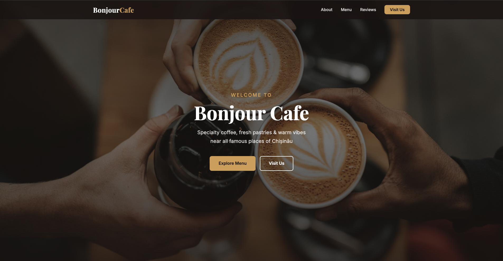
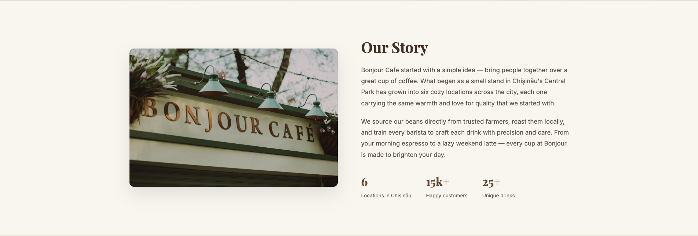
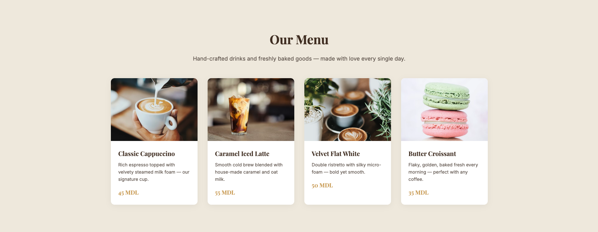
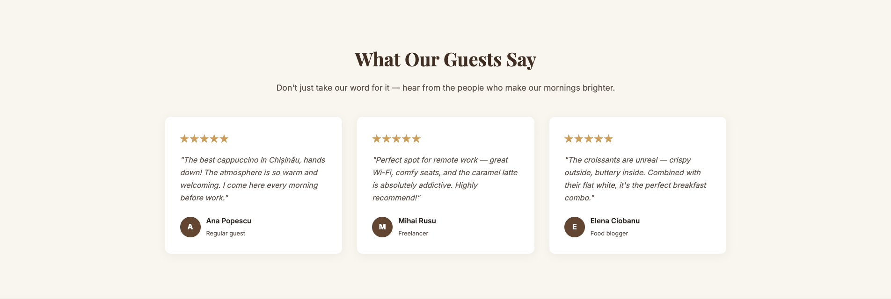
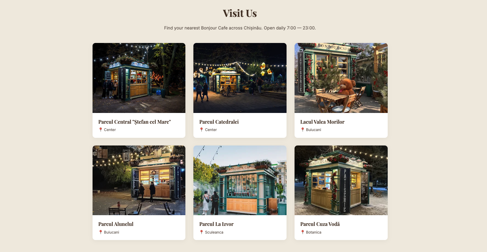
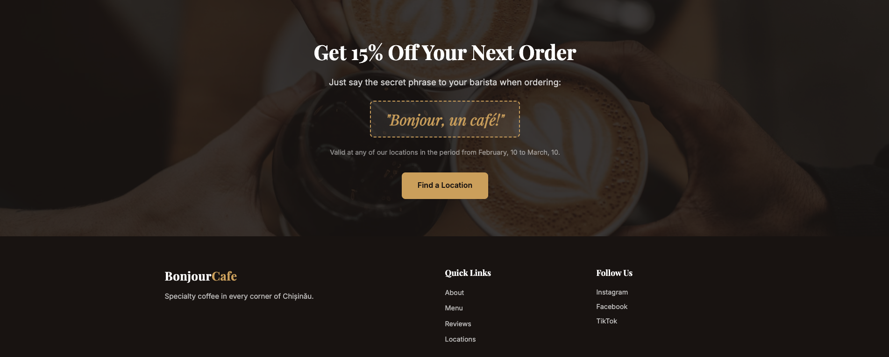

# Bonjour Cafe ☕

A landing page for **Bonjour Cafe** — a cozy specialty coffee shop located in the heart of Chișinău, Moldova.

## About

Bonjour Cafe is a warm and welcoming café offering hand-crafted specialty coffee, freshly baked pastries, and a relaxing atmosphere for work, study, or catching up with friends.

## Features

- **Responsive design** — looks great on desktop, tablet, and mobile
- **Smooth navigation** — sticky navbar with anchor links to all sections
- **CSS-only mobile menu** — hamburger toggle without JavaScript
- **Call to action** — prominent "Explore Menu" and "Visit Us" buttons
- **6 sections**: Hero, About, Menu Highlights, Testimonials, Contact, Footer

## Tech Stack

- Vanilla HTML5
- Vanilla CSS3 (custom properties, grid, flexbox)
- Google Fonts (Playfair Display + Inter)
- No JavaScript frameworks

## Live Demo

🔗 [View Live Demo](https://drive.google.com/file/d/1ZEP0nfu1fEJY0mfJn-OcwQEJ2jYC5Fkw/view?usp=sharing)

## Screenshots

### Welcome


### Our Story


### Our Menu


### Reviews


### Visit Us


### Secret Code & Footer


## Getting Started

Simply open `index.html` in your browser, or serve it with any static file server:

```bash
# Using Python
python3 -m http.server 8000

# Using Node.js
npx serve .
```
